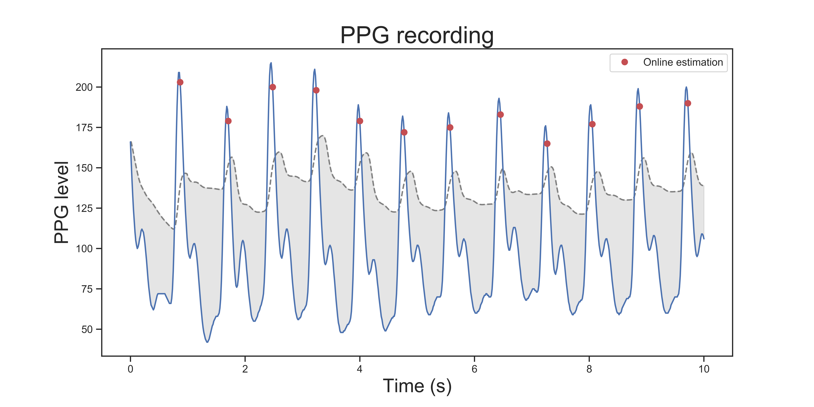

# ect-python
Embodied Computation Toolbox
(still under development)

# Installation

Download the zip file, extract the folder and run from the terminal:

`python setup.py install`

# Recording

## Oximeter
Recording signal with the [Nonin 3012LP Xpod USB pulse oximeter](https://www.nonin.com/products/xpod/) together with [Nonin 8000SM 'soft-clip' fingertip sensors](https://www.nonin.com/products/8000s/).

### Quick start

Record and plot data with less than 6 lines of code.

```python
import serial
from ect.recording import Oximeter
ser = serial.Serial('COM4')  # Add your USB port here

# Open serial port, initialize and plot recording for Oximeter
oxi = Oximeter(serial=ser, sfreq=75).setup().read(duration=10)

# Plot data
oxi.plot()
```


### Recording

2 methods are available to record PPG signal:

* The `read()` method will continuously record for certain amount of
time (specified by the `duration` parameter, in seconds). This is the
easiest and most robust method, but it is not possible to run
instructions in the meantime (serial mode).

```python
# Code 1 {}
oximeter.read(duration=10)
# Code 2 {}
```

* The `readInWaiting()` method will read all the availlable bytes (up
to 10 seconds of recording). When inserted into a while loop, it allows
to record PPG signal in parallel with other commands.

```python
import time
tstart = time.time()
while time.time() - tstart < 10:
    oximeter.readInWaiting()
    # Insert code here {...}
```
