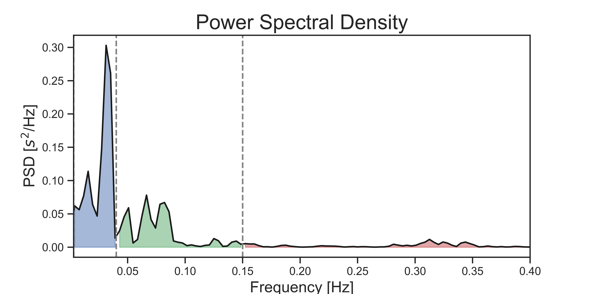

.. image:: https://img.shields.io/badge/License-GPL%20v3-blue.svg
  :target: https://github.com/LegrandNico/systole/blob/master/LICENSE

.. image:: https://zenodo.org/badge/219720901.svg
   :target: https://zenodo.org/badge/latestdoi/219720901

.. image:: https://badge.fury.io/py/systole.svg
   :target: https://badge.fury.io/py/systole

================

.. figure::  images/banner.png
   :align:   center

================

**Systole** is an open-source Python package providing simple tools to record and analyze body signal for psychophysiology.

Installation
============

Systole can be installed using pip:

.. code-block:: shell

  pip install systole

The following package will be required to use Systole:

* Numpy (>=1.15)
* SciPy (>=1.3.0)
* Pandas (>=0.24)
* Matplotlib (>=3.0.2)
* Seaborn (>=0.9.0)

Recording
=========

Systole supports the recording of PPG signal through the `Nonin 3012LP Xpod USB pulse oximeter <https://www.nonin.com/products/xpod/>`_ together with the `Nonin 8000SM 'soft-clip' fingertip sensors <https://www.nonin.com/products/8000s/>`_.
It can easily interface with `PsychoPy <https://www.psychopy.org/>`_ to record PPG signal during psychological experiments.

Record and plot data with less than 6 lines of code.

.. code-block:: python

  import serial
  from systole.recording import Oximeter
  ser = serial.Serial('COM4')  # Add your USB port here

  # Open serial port, initialize and plot recording for Oximeter
  oxi = Oximeter(serial=ser).setup().read(duration=10)

Interfacing with PsychoPy
-------------------------

2 methods are available to record PPG signal:

* The `read()` method

Will continuously record for a certain amount of time (specified by the
`duration` parameter, in seconds). This is the easiest and most robust method,
but it is not possible to run instructions in the meantime (serial mode).

.. code-block:: python

  # Code 1 {}
  oximeter.read(duration=10)
  # Code 2 {}

* The `readInWaiting()` method

Will read all the available bytes (up to 10 seconds of recording). When
inserted into a while loop, it allows recording PPG signal in parallel with
other commands.

.. code-block:: python

  import time
  tstart = time.time()
  while time.time() - tstart < 10:
      oximeter.readInWaiting()
      # Insert code here {...}

Online detection
----------------

Online heart beat detection.

.. code-block:: python

  import serial
  import time
  from systole.recording import Oximeter

  # Open serial port
  ser = serial.Serial('COM4')  # Change this value according to your setup

  # Create an Oxymeter instance and initialize recording
  oxi = Oximeter(serial=ser, sfreq=75, add_channels=4).setup()

  # Online peak detection for 10 seconds
  tstart = time.time()
  while time.time() - tstart < 10:
      while oxi.serial.inWaiting() >= 5:
          paquet = list(oxi.serial.read(5))
          oxi.add_paquet(paquet[2])  # Add new data point
          if oxi.peaks[-1] == 1:
            print('Heartbeat detected')

Peaks detection
===============
Heart beat can be detected in the PPG signal either online or offline.

Methods from clipping correction and peak detection algorithm is adapted from [#]_.

.. code-block:: python

  # Plot data
  oxi.plot()

.. figure::  images/recording.png
   :align:   center

Artifact removal
================
It is possible to detect and correct outliers from RR time course following the method described in [#]_.

.. code-block:: python

  from systole import import_rr()
  from systole.plotting import plot_subspaces

  rr = import_rr().rr[:100]
  rr[20] = 1600  # Add missed beat

  plot_subspaces(rr)

.. figure::  images/subspaces.png
   :align:   center

Heart rate variability
======================

Time-domain
-----------

Extract the summary of time-domain indexes.

.. code-block:: python

  from systole.hrv import time_domain

  stats = time_domain(rr)
  stats

Frequency-domain
----------------
.. code-block:: python

  from systole.hrv import plot_psd

  plot_psd(rr)

Extract the summary of frequency-domain indexes.

.. code-block:: python

  from systole.hrv import frequency_domain

  frequency_domain(rr)

.. table:: Output
   :widths: auto

   +-----------+---------------+
   | *Metric*  | *Value*       |
   +-----------+---------------+

Non-linear
----------

.. code-block:: python

  from systole.hrv import nonlinear

  nonlinear(rr)

All the results have been tested against Kubios HVR 2.2 (<https://www.kubios.com>).

Development
===========

This module was created and is maintained by Nicolas Legrand and Micah Allen (ECG group, https://the-ecg.org/). If you want to contribute, feel free to contact one of the contributors, open an issue or submit a pull request.

This program is provided with NO WARRANTY OF ANY KIND.

Acknowledgement
===============

This software supported by a Lundbeckfonden Fellowship (R272-2017-4345), and the AIAS-COFUND II fellowship programme that is supported by the Marie Skłodowska-Curie actions under the European Union’s Horizon 2020 (Grant agreement no 754513), and the Aarhus University Research Foundation.

Systole was largely inspired by preexisting toolboxes dedicated to heart rate variability and signal analysis.

* HeartPy: https://python-heart-rate-analysis-toolkit.readthedocs.io/en/latest/

* hrv: https://github.com/rhenanbartels/hrv

* ECG-detector: https://github.com/berndporr/py-ecg-detectors

* Pingouin: https://pingouin-stats.org/

References
==========

**Peak detection (PPG signal)**

.. [#] van Gent, P., Farah, H., van Nes, N., & van Arem, B. (2019). HeartPy: A novel heart rate algorithm for the analysis of noisy signals. Transportation Research Part F: Traffic Psychology and Behaviour, 66, 368–378. https://doi.org/10.1016/j.trf.2019.09.015

**Artefact detection and correction:**

.. [#] Lipponen, J. A., & Tarvainen, M. P. (2019). A robust algorithm for heart rate variability time series artefact correction using novel beat classification. *Journal of Medical Engineering & Technology, 43(3), 173–181*. https://doi.org/10.1080/03091902.2019.1640306
